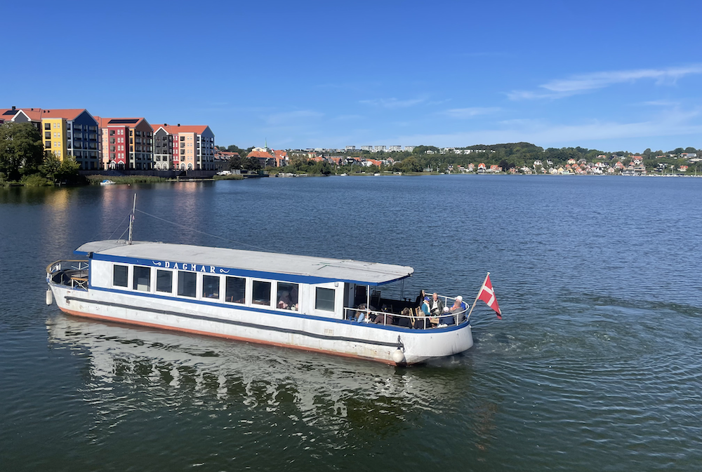
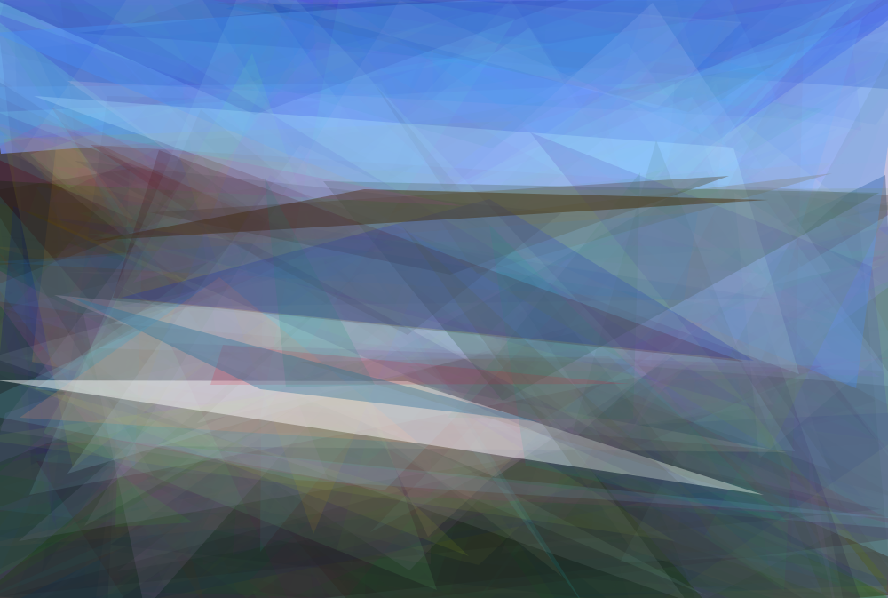
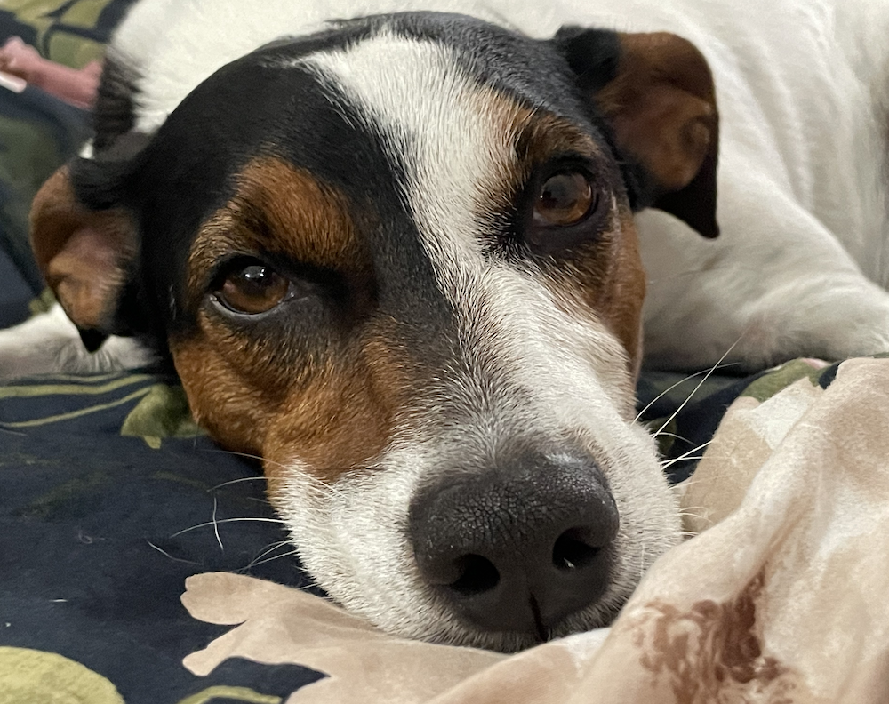
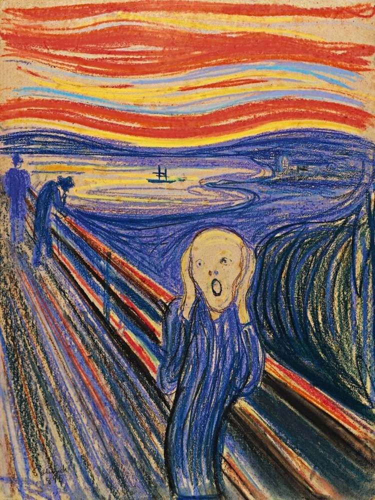
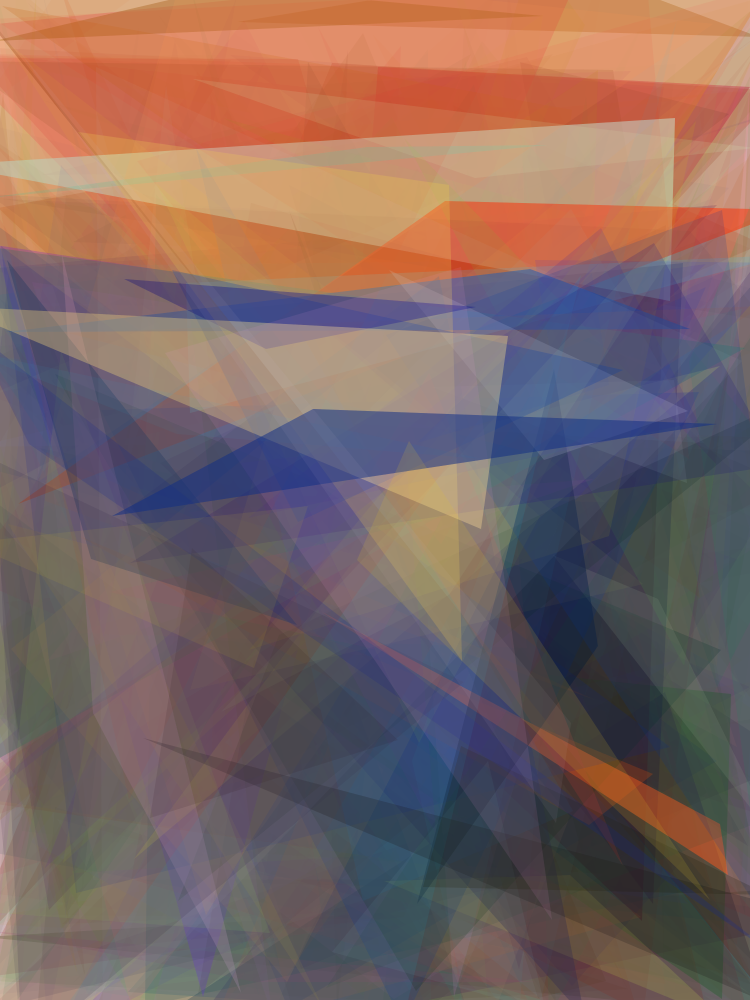
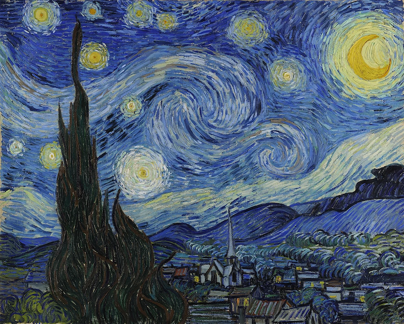
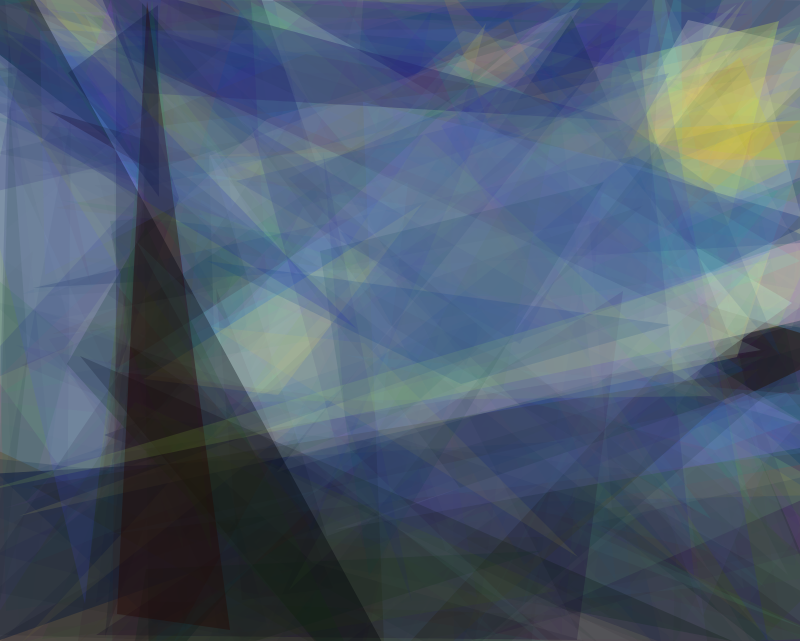
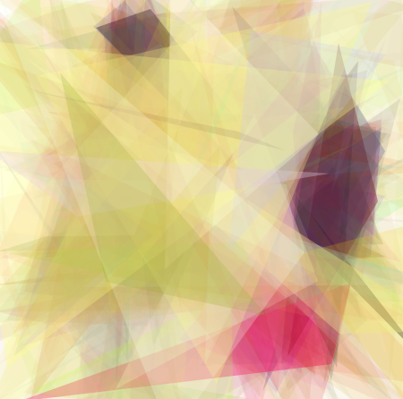
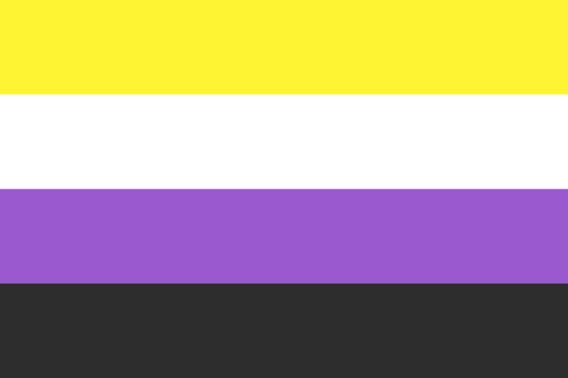
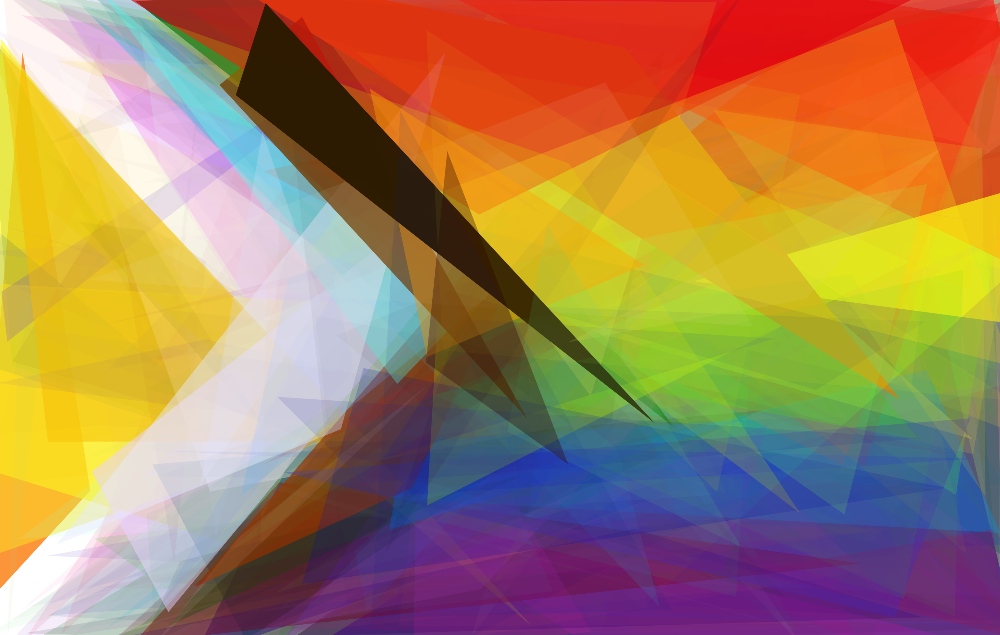

# 500 triangles

Generate any image using 500 triangles and a genetic algorithm

This is me just playing with genetic algorithms.

## Usage

    npm install
    npm run build

Add an image called `reference.png` into a folder and run this on that folder

    npm run start [folder]

You will see an output image every 10 generations, and a CSV log file so you can track how the fitness is progressing, and how the mutation rate is changing.

## Examples

### Skanderborg lake

| Input                                                       | Output                                                         |
| ----------------------------------------------------------- | -------------------------------------------------------------- |
|        |        |
|                      |                      |
|          |          |
|      |      |
|      |      |
|                      |                      |
|  |  |

## More details

I have a blog post coming soon.
